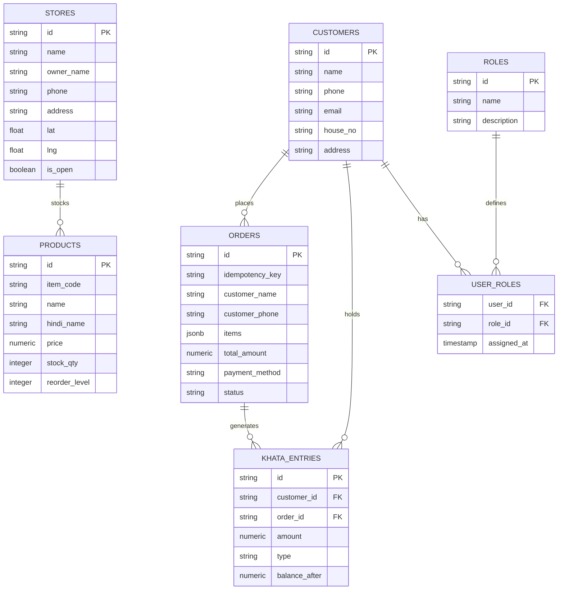

# Mohalla Kirana App - Database Schema & API Specifications

This document contains the complete database DDL definitions, Entity-Relationship Diagram (ERD), REST API endpoints, Edge Function contracts, and Row Level Security (RLS) policies for the **Mohalla Kirana Platform**.

---

## 1. Entity-Relationship Diagram (ERD)



---

## 2. PostgreSQL DDL Schema Definitions

### Table 1: `public.products`
```sql
CREATE TABLE IF NOT EXISTS public.products (
  id TEXT PRIMARY KEY,
  item_code TEXT NOT NULL UNIQUE,
  item_name_en TEXT NOT NULL,
  item_name_hi TEXT NOT NULL,
  name TEXT NOT NULL,
  hindi_name TEXT NOT NULL,
  category TEXT NOT NULL,
  price NUMERIC(10, 2) NOT NULL,
  unit TEXT NOT NULL,
  image TEXT NOT NULL,
  in_stock BOOLEAN DEFAULT true,
  keywords TEXT[] DEFAULT '{}',
  stock_qty INTEGER DEFAULT 50,
  reorder_level INTEGER DEFAULT 10,
  supplier TEXT DEFAULT 'Delhi FMCG Wholesalers',
  created_at TIMESTAMPTZ DEFAULT NOW()
);
```

### Table 2: `public.stores`
```sql
CREATE TABLE IF NOT EXISTS public.stores (
  id TEXT PRIMARY KEY,
  name TEXT NOT NULL,
  owner_name TEXT NOT NULL,
  phone TEXT NOT NULL,
  address TEXT NOT NULL,
  lat DOUBLE PRECISION NOT NULL,
  lng DOUBLE PRECISION NOT NULL,
  radius_km NUMERIC(5, 2) DEFAULT 1.5,
  rating NUMERIC(3, 2) DEFAULT 4.9,
  orders_completed INTEGER DEFAULT 1420,
  is_open BOOLEAN DEFAULT true,
  khata_accepted BOOLEAN DEFAULT true,
  created_at TIMESTAMPTZ DEFAULT NOW()
);
```

### Table 3: `public.orders`
```sql
CREATE TABLE IF NOT EXISTS public.orders (
  id TEXT PRIMARY KEY,
  idempotency_key TEXT UNIQUE NOT NULL,
  customer_name TEXT NOT NULL,
  customer_phone TEXT NOT NULL,
  address TEXT NOT NULL,
  items JSONB NOT NULL DEFAULT '[]',
  total_amount NUMERIC(10, 2) NOT NULL,
  payment_method TEXT NOT NULL,
  payment_status TEXT NOT NULL,
  status TEXT NOT NULL,
  order_type TEXT NOT NULL,
  assigned_delivery_boy TEXT,
  created_at TIMESTAMPTZ DEFAULT NOW()
);
```

### Table 4: `public.khata_entries`
```sql
CREATE TABLE IF NOT EXISTS public.khata_entries (
  id TEXT PRIMARY KEY,
  customer_id TEXT NOT NULL,
  customer_name TEXT NOT NULL,
  customer_phone TEXT NOT NULL,
  order_id TEXT,
  date DATE NOT NULL DEFAULT CURRENT_DATE,
  description TEXT NOT NULL,
  amount NUMERIC(10, 2) NOT NULL,
  type TEXT NOT NULL,
  items_summary TEXT,
  created_at TIMESTAMPTZ DEFAULT NOW()
);
```

### Table 5: `public.customers`
```sql
CREATE TABLE IF NOT EXISTS public.customers (
  id TEXT PRIMARY KEY,
  name TEXT NOT NULL,
  phone TEXT NOT NULL UNIQUE,
  email TEXT,
  address TEXT NOT NULL,
  house_no TEXT NOT NULL,
  password_hash TEXT NOT NULL DEFAULT 'pass123',
  created_at TIMESTAMPTZ DEFAULT NOW()
);
```

### Table 6: `public.roles` & Table 7: `public.user_roles` (Enterprise Many-to-Many RBAC)
```sql
CREATE TABLE IF NOT EXISTS public.roles (
  id TEXT PRIMARY KEY,
  name TEXT UNIQUE NOT NULL,
  description TEXT,
  created_at TIMESTAMPTZ DEFAULT NOW()
);

CREATE TABLE IF NOT EXISTS public.user_roles (
  user_id TEXT NOT NULL,
  role_id TEXT NOT NULL,
  assigned_at TIMESTAMPTZ DEFAULT NOW(),
  PRIMARY KEY (user_id, role_id),
  FOREIGN KEY (role_id) REFERENCES public.roles(id) ON DELETE CASCADE
);
```

---

## 3. Supabase Edge Function Contracts

### Endpoint 1: Idempotent Order Processor (`/functions/v1/process-order`)
- **Method**: `POST`
- **Headers**: `Content-Type: application/json`, `Authorization: Bearer <ANON_KEY>`
- **Request Body**:
```json
{
  "idempotencyKey": "idemp_1724067000000_abc123",
  "customerName": "Anjali Verma",
  "customerPhone": "+91 98765 43210",
  "address": "House #42, Pocket B, Sarita Vihar",
  "items": [
    { "productId": "p1", "productName": "Wheat Atta", "price": 37, "quantity": 5 }
  ],
  "totalAmount": 185,
  "paymentMethod": "khata",
  "orderType": "voice_note"
}
```
- **Response**:
```json
{
  "success": true,
  "isCached": false,
  "order": {
    "id": "ORD-4921",
    "status": "pending",
    "totalAmount": 185
  }
}
```

---

## 4. Row Level Security (RLS) Policies
```sql
ALTER TABLE public.products ENABLE ROW LEVEL SECURITY;
ALTER TABLE public.stores ENABLE ROW LEVEL SECURITY;
ALTER TABLE public.orders ENABLE ROW LEVEL SECURITY;
ALTER TABLE public.khata_entries ENABLE ROW LEVEL SECURITY;
ALTER TABLE public.customers ENABLE ROW LEVEL SECURITY;
ALTER TABLE public.roles ENABLE ROW LEVEL SECURITY;
ALTER TABLE public.user_roles ENABLE ROW LEVEL SECURITY;

CREATE POLICY "Public Read/Write Products" ON public.products FOR ALL USING (true);
CREATE POLICY "Public Read/Write Stores" ON public.stores FOR ALL USING (true);
CREATE POLICY "Public Read/Write Orders" ON public.orders FOR ALL USING (true);
CREATE POLICY "Public Read/Write Khata Entries" ON public.khata_entries FOR ALL USING (true);
CREATE POLICY "Public Read/Write Customers" ON public.customers FOR ALL USING (true);
CREATE POLICY "Public Read/Write Roles" ON public.roles FOR ALL USING (true);
CREATE POLICY "Public Read/Write User Roles" ON public.user_roles FOR ALL USING (true);
```
