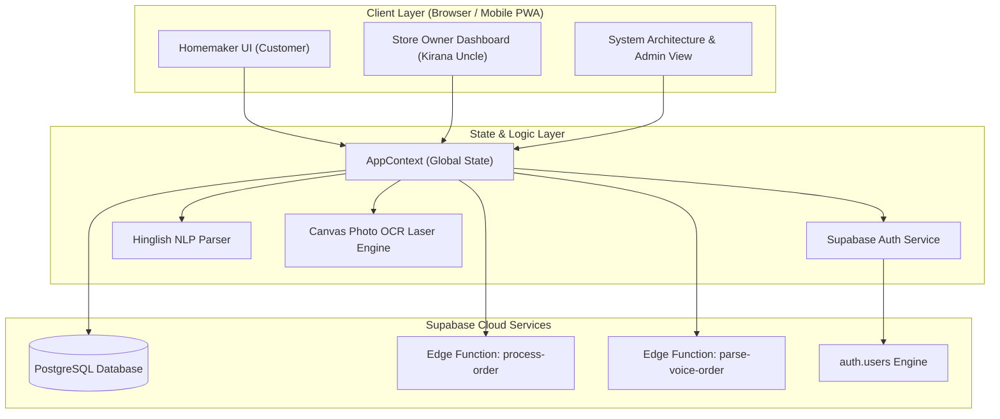

# Mohalla Kirana App - System Architecture & Technical Specifications

## 1. Executive Summary
**Mohalla Kirana App** is a hyper-local neighborhood grocery ordering, credit ledger, and delivery platform designed for urban Indian neighborhoods (Mohallas). It bridges traditional Kirana stores (small neighborhood grocery shops) with modern digital capabilities like Speech-to-Text Voice Ordering in Hinglish, Handwritten Photo List OCR Scanning, Digital Khata Credit Ledgers, Live UPI Deep-Linking, and HTML5 Canvas Live Delivery Partner Tracking.

---

## 2. Technology Stack

| Layer | Technologies Used |
| :--- | :--- |
| **Frontend Framework** | React 18 (TypeScript), Vite 5, Tailwind CSS |
| **State Management** | React Context API (`AppContext.tsx`) with LocalStorage session persistence |
| **Backend & Database** | Supabase (PostgreSQL 15), Supabase JavaScript Client SDK |
| **Serverless Computing** | Supabase Edge Functions (Deno / TypeScript runtime) |
| **Authentication & RBAC** | Supabase Native Auth (`auth.users`) + Enterprise Many-to-Many RBAC (`roles` & `user_roles` JOIN table) |
| **UI Components & Icons** | Lucide React, Canvas-Confetti, HTML5 Canvas API |
| **DevOps & CI/CD** | GitHub Actions (`deploy.yml`), GitHub Pages automated deployment, Supabase CLI automated migrations |

---

## 3. High-Level System Architecture Diagram

---

## 4. Key Architectural Pillars

### A. 100% Dynamic Supabase Database Engine
No hardcoded static product catalogs or dummy customer profiles. All data is fetched live from Supabase tables:
- `public.products`: Dynamic catalog inventory.
- `public.stores`: Kirana shop profiles & geofence metadata.
- `public.orders`: Live customer orders submitted via Voice, Photo OCR, or Cart.
- `public.khata_entries`: Ledger transactions (debits for purchases, credits for UPI settlements).
- `public.customers`: Homemaker user profile directory.
- `public.roles` & `public.user_roles`: Enterprise Many-to-Many RBAC authorization engine.

### B. Idempotency & Fault-Tolerant Ordering
To safeguard against poor mobile network connectivity or duplicate button clicks:
- Each order generates a cryptographically unique `idempotencyKey` (`idemp_<timestamp>_<rand>`).
- Supabase Edge Function `process-order` inspects `orders.idempotency_key`. If duplicate, it returns the cached response without double-charging or creating duplicate store orders.

### C. Live Real Payment Integrations (UPI & Stripe)
- **UPI Deep-Linking**: Generates native `upi://pay?pa=guptakirana@upi&pn=Store&am=TOTAL&cu=INR` links that launch Google Pay, PhonePe, Paytm, or BHIM.
- **Dynamic UPI QR Code**: Generates dynamic QR codes displaying exact cart totals.
- **Stripe / Card Gateway**: Integrated credit/debit card payment portal.

### D. Dual Language & Multi-Role UI Context
- Native support for **English** and **Hindi (हिन्दी)**.
- Single-click role switching between **Homemaker (Customer)**, **Store Owner (Kirana Uncle)**, and **Platform Admin**.

### E. Multi-Theme Engine & Admin Appearance Customizer
- **6 Theme Modes**: Supports curated color themes (`dark`, `light`, `emerald`, `sapphire`, `sunset`, `cyberpunk`).
- **Global CSS Variables**: Managed via dataset attributes (`html[data-theme="..."]`) for instant zero-reload transitions.
- **Admin Customizer**: Integrated visual Theme Manager (`AdminThemeSelector.tsx`) with color swatches, component preview sandbox, and token exporter.

### F. HTML5 History API Routing & Distinct Flow URLs
- Synchronizes app view mode with browser address bar URLs:
  - **Homemaker Customer App**: `/` or `/customer`
  - **Kirana Merchant Dashboard**: `/merchant` or `/storeowner`
  - **Platform Admin Panel**: `/admin`
- Protected Route Guard: Unauthenticated access to `/admin` renders a Platform Admin Authentication Required guard screen.

### G. Universal Modal UX & Backdrop Click-to-Close
- All 7 overlay modals (`VoiceOrderModal`, `PhotoOrderModal`, `CartAndCheckoutModal`, `CustomerAuthModal`, `LiveDeliveryTrackingModal`, `ThermalReceiptModal`, `DeliveryAssignmentModal`) support backdrop click-to-close behavior with event propagation isolation.
